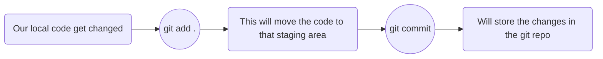

## Basic Git Commands Reference

A quick guide to the most commonly used Git commands.

## What is Git?

- Git is a distributed version control system used to track changes in files and projects.
- Git allows you to save versions of your project using commits.
- GitHub is a platform used to host Git repositories and collaborate with others.

## Getting Started

- `git init` : Initialize a new local Git repository in a existing directory.
- `git init <YOUR_REPO_NAME>` : Initialize a new local Git repository in a new directory.
- `git clone <URL>` : Download a project and its entire version history from a remote repository.
- `git status` : Shows the current state of the working directory and staging area.

## Connecting the User Account and Repo

- `git config --global user.name "Your Name"` : Sets the default name used for commits.
- `git config --global user.email "you@example.com"` : Sets the default email used for commits.
- `git config --list` : Displays the current Git configuration.
- `git branch -M main` : Renames the current branch to main.
- `git remote add origin <YOUR_REPO_URL_HERE>`: Connects the local repository to a remote repository.
- `git remote -v` : Lists the configured remote repositories.

## Staging & Committing

In Git, the **staging area** is an `intermediate area` between our **working directory and the Git repository**

- `git add <file>` : Stages a specific file for the next commit.
- `git add .` : Stages all changes in the current directory.
- `git commit -m "<message>"` : Records the staged changes in the repository history.

## Logs

Basically the logs are the **history of commit and its detail** that are `recorded by the Git` in your repository.

- `git log` : This will the every commit along with their detail in your repository.
- `git log -3` : This one shows the last 3 commit. you can use any numbers.
- `git log --Agent.py` : This shows only the commits that included changes to Agent.py.
- `git log -3 --Agent.py` : This combines both command, It show the last 3 commits that happened this file.
- `git log --since="Apr 12 2026"` : By using since keyword we specify a date. Then Git will show commits from that date up to the latest one.
- `git log --since="Arp 12 2026 --until="May 12 2026"` : This will shows the commit within this range.   

## Branching & Merging

- `git branch` : Lists all local branches in the current repository.
- `git branch <branch-name>` : Creates a new branch.
- `git switch <branch-name>` : Switches to the specified branch.
- `git switch -c <branch-name>` : Creates a new branch and switches to it.
- `git checkout <branch-name>` : Switches to the specified branch.
- `git checkout -b <branch-name>` : Creates a new branch and switches to it.
- `git merge <branch-name>` : Combines the specified branch's history into the current branch.

## Remote Repositories

- `git remote -v` : Lists all current configured remote repositories.
- `git remote add origin <url>` : Adds a remote repository named origin.
- `git push <remote> <branch>` : Uploads local commits to a remote repository.
- `git push -u origin main` : Pushes the main branch and sets the upstream branch.
- `git pull <remote> <branch>` : Fetches and merges changes from the remote repository.
- `git fetch <remote>` : Downloads changes from a remote repository without merging them.

## Inspection & History

- `git status` : Lists new, modified, staged, and untracked files.
- `git diff` : Shows changes that have not yet been staged.
- `git show <commit>` : Displays the details and changes of a specific commit.
- `git log` : Lists the version history for the current branch.
- `git log --oneline` : Shows a short version of the commit history.

## Undoing Changes

- `git reset <file>` : Unstages the file while preserving its changes.
- `git revert <commit>`: Creates a new commit that undoes the changes from a previous commit.

## Getting Help

- `git help` : Opens Git's general help documentation.
- `git <command> --help` : Displays help and documentation for a specific Git command.
